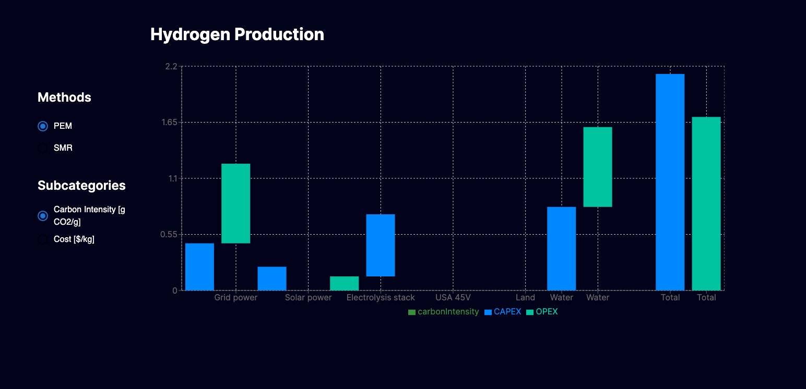
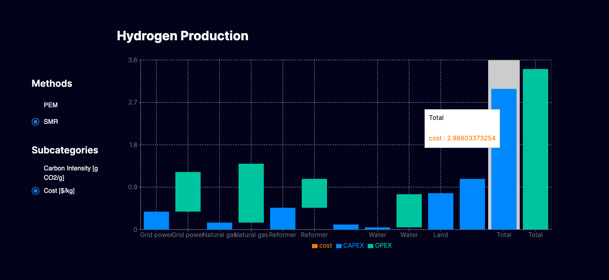

This is a [Next.js](https://nextjs.org/) project bootstrapped with [`create-next-app`](https://github.com/vercel/next.js/tree/canary/packages/create-next-app).

## Getting Started

First, run the development server:

```bash
npm run dev
# or
yarn dev
# or
pnpm dev
```

Open [http://localhost:3000](http://localhost:3000) with your browser to see the result.

Or go to https://othersphere.vercel.app/




### Approach

1. Determine how to fetch the data.

   - `getStaticProps` is used to fetch the data before the page is rendered.
   - The data is converted to a string, then parsed using `react-papaparse`. The data returned is an array of arrays.

2. Process the data by building an object for each item.

   - This returns useful information for each piece of data.
   - The `buildDataObj` calculates the cumulative and previous values for the cost and carbon intensity. These values are used to create a waterfall effect later in the `BarChart`.
   - `getTotal` calculates the final total for OPEX and CAPEX subcategories. The object returned from getTotal is pushed into the `_obj` placeholder array. The `_obj` array is returned from `buildDataObj`.

3. Build the UI using `Material UI` and the bar graph using `Recharts`

   - The Radio groups and element groupings use Material UI to display the options.
   - The Bar Chart is used to create the waterfall effect using the cumulative and previous values for the cost and carbon intensity.
   - `Options` and `WaterfallChart` are the main components.

4. Assumptions:
   - As noted in the instructions, Cost and Carbon Intensity may be changed or other fields are added in the future. In the interest of time, the code assumes only Cost and Carbon Intensity are the only options available. Further refactoring would be required if other options are added.

### Time spent

`>` 5 hours because I thought this was a fun and interesting challenge. I used this as an opportunity to learn a bit about waterfall charts and using Recharts.
